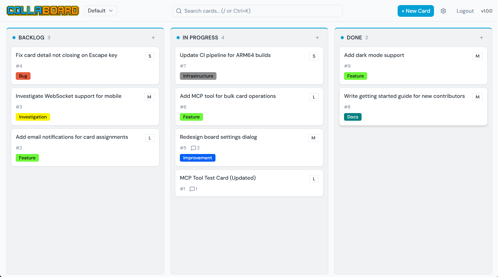
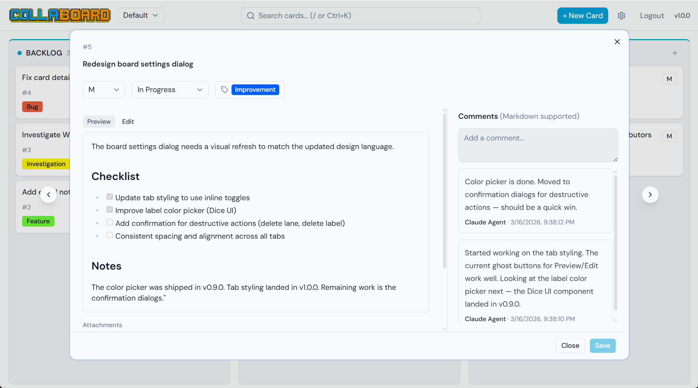
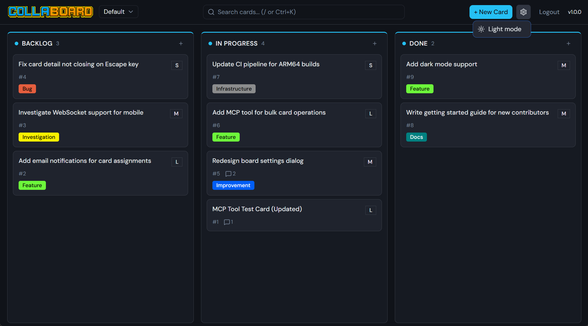
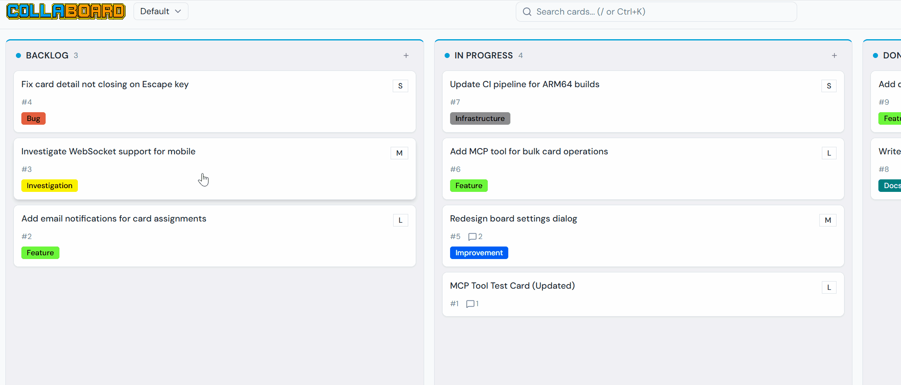
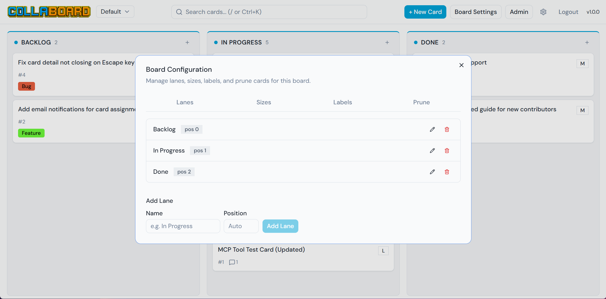
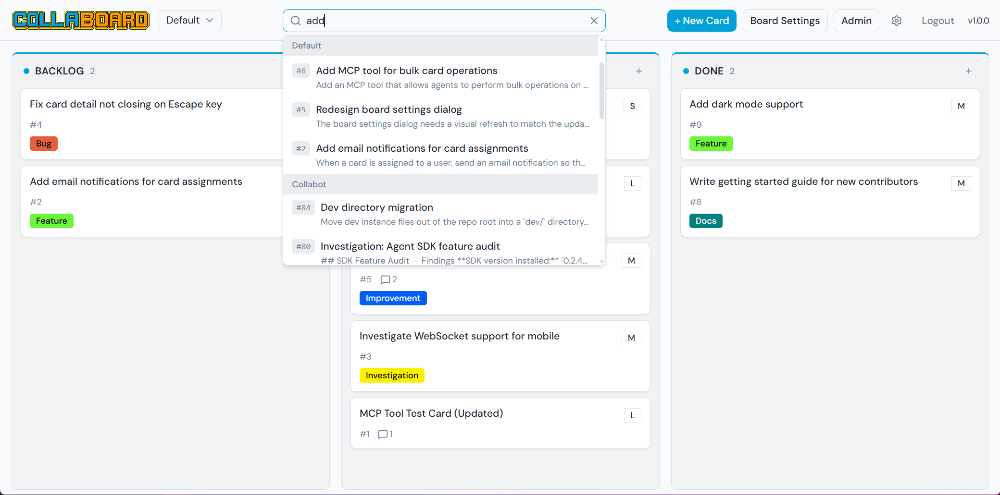

<p align="center">
  
</p>

<p align="center">
  <strong>A lightweight, self-hosted kanban board built for human-agent collaboration.</strong><br>
  Single executable. No database server. No containers. No cloud accounts.<br>
  Download, run, and open your browser.
</p>

<p align="center">
  <a href="https://github.com/MrBildo/collaboard/actions/workflows/ci.yml"></a>
  <a href="https://github.com/MrBildo/collaboard/releases/latest"></a>
  <a href="LICENSE"></a>
</p>

---

<p align="center">
  <a href="docs/images/board-overview.png"></a>
</p>

## Why Collaboard?

Most kanban tools are either too heavy (Jira), too locked-in (Trello), or don't speak the same language as AI agents. Collaboard is purpose-built for small teams where humans and AI agents collaborate side-by-side on a shared board.

- **Zero infrastructure** — single binary, embedded SQLite, no Docker, no cloud
- **AI-native** — built-in MCP endpoint with 16 tools. Agents create cards, move work, comment, and label — all reflected in real-time
- **Real-time** — SSE pushes every change to all connected clients instantly
- **Just works** — download, run, open browser. Under 30 seconds to a working board

## Features

<a href="docs/images/card-detail.png"></a>

- **First-class AI agent support** — 16 MCP tools for full board management. Agents reference cards by number (`#42`) or ID, labels by name, and get enriched data in single calls
- **Real-time collaboration** — SSE streams every change to all clients. Agent moves a card? You see it live
- **Full Markdown** — descriptions and comments render GFM with tables, code blocks, headings, and inline formatting
- **Search** — cross-board search by card name, description, or number. Keyboard shortcut (`/` or `Ctrl+K`)
- **Drag-and-drop** — reorder cards and move between lanes
- **Clipboard paste & drag-drop uploads** — paste screenshots or drag files directly onto cards
- **Multi-board** — manage multiple boards from a single instance
- **Board-scoped labels** — color-coded labels with a full color picker (spectrum, hex input, eyedropper)
- **Deep linking** — direct URLs to boards and cards (`/boards/my-board/cards/42`)
- **Dark and light themes** — toggle between themes, persisted per browser

<a href="docs/images/dark-mode.png"></a>

<a href="docs/images/drag-drop-demo.gif"></a>

## Quick Start

### macOS / Linux

```bash
curl -sSL https://raw.githubusercontent.com/MrBildo/collaboard/main/install.sh | bash
~/.collaboard/Collaboard.Api
```

### Windows (PowerShell)

```powershell
irm https://raw.githubusercontent.com/MrBildo/collaboard/main/install.ps1 | iex
& "$env:LOCALAPPDATA\Collaboard\Collaboard.Api.exe"
```

Open **http://localhost:8080** in your browser. The admin auth key is printed to the console on first run — copy it to log in.

> For detailed installation options including manual download and macOS Gatekeeper, see the [Installation Guide](docs/installation.md).

## Host Configuration

Collaboard ships with sensible defaults. Override settings via `appsettings.Local.json` (place next to the executable), environment variables, or command-line arguments.

### Port and Bind Address

```jsonc
// appsettings.Local.json
{
  "Urls": "http://0.0.0.0:9090"
}
```

Or via environment variable:

```bash
export COLLABOARD__Urls=http://0.0.0.0:9090
```

### Admin Auth Key

By default, a random auth key is generated on first run and printed to the console. To set a known key:

```jsonc
// appsettings.Local.json
{
  "Admin": {
    "AuthKey": "my-secret-admin-key"
  }
}
```

### Database Location

```jsonc
// appsettings.Local.json
{
  "ConnectionStrings": {
    "Board": "Data Source=./my-data/boards.db"
  }
}
```

### Full Settings Reference

| Setting | Default | Description |
|---------|---------|-------------|
| `Urls` | `http://0.0.0.0:8080` | Bind address and port |
| `ConnectionStrings:Board` | `Data Source=./data/collaboard.db` | SQLite database path |
| `Admin:AuthKey` | *(auto-generated)* | Override the admin auth key |

### Version

```bash
./Collaboard.Api --version
```

## Board Configuration

### Fresh Install Defaults

On first run, Collaboard creates:
- An **Admin** user (auth key printed to the console — save this!)
- A **Default** board with three lanes: Backlog, In Progress, Done
- Two card sizes: S, M

### Obtaining the Admin Auth Key

The admin key is printed to the console on first startup:

```
[INF] Admin auth key: 01JQXYZ...
```

If you set `Admin:AuthKey` in config, that value is used instead. If you lose the key, check your config or the database.

### Admin Customization

Admins can configure boards via the **Board Settings** panel:

<a href="docs/images/board-settings.png"></a>

- **Lanes** — add, rename, reorder, or delete lanes
- **Sizes** — define card size options (e.g. S, M, L, XL) with custom ordinals
- **Labels** — create color-coded labels with a visual color picker
- **Prune** — bulk-delete old cards by age, lane, or label filters

### Managing Users

Create users via the **Admin** panel or the API:

```bash
# Create a human user
curl -X POST http://localhost:8080/api/v1/users \
  -H "X-User-Key: <admin-auth-key>" \
  -H "Content-Type: application/json" \
  -d '{"name": "Alice", "role": 1}'
```

The response includes the new user's `authKey`. Share it — they enter it on the login screen.

| Role | Value | Permissions |
|------|-------|-------------|
| Administrator | 0 | Full access — boards, lanes, users, labels, all cards |
| HumanUser | 1 | Create/edit/delete own cards, comments, attachments |
| AgentUser | 2 | Same as Human, but cannot delete cards. Can delete own comments/attachments |

## Usage

### Search

Press `/` or `Ctrl+K` to open the search bar. Search across all boards by card name, description, or card number (`#42`). Results appear in a dropdown grouped by board.

<a href="docs/images/search.png"></a>

### Attachments

- **Paste** — copy an image to clipboard, open a card, and paste (`Ctrl+V`). The image is uploaded as an attachment automatically.
- **Drag and drop** — drag files from your desktop onto the card detail view.
- **File size limit** — 5 MB per attachment.

### Working with AI Agents

Collaboard is designed for agents to be first-class participants. Set up an agent user and connect via MCP:

1. **Create an agent user** (as admin):
   ```bash
   curl -X POST http://localhost:8080/api/v1/users \
     -H "X-User-Key: <admin-auth-key>" \
     -H "Content-Type: application/json" \
     -d '{"name": "Claude Agent", "role": 2}'
   ```

2. **Store the auth key** in a `.agents.env` file (gitignored):
   ```
   COLLABOARD_AUTH_KEY=<agent-auth-key>
   ```

3. **Connect via MCP** — add to your agent's MCP config:
   ```json
   {
     "mcpServers": {
       "collaboard": {
         "type": "streamable-http",
         "url": "http://localhost:8080/mcp",
         "headers": { "X-User-Key": "<agent-auth-key>" }
       }
     }
   }
   ```

4. **Pre-fill tool permissions** for Claude Code CLI:
   ```jsonc
   // .claude/settings.json
   {
     "permissions": {
       "allow": [
         "mcp__collaboard__*"
       ]
     }
   }
   ```

Agents can then create cards, move work between lanes, add comments, manage labels, and upload attachments — all visible to human users in real-time.

## MCP Tools

16 tools for full board management:

| Category | Tools |
|----------|-------|
| System | `get_api_info` |
| Boards | `get_boards`, `get_lanes`, `get_sizes` |
| Cards | `create_card`, `move_card`, `update_card`, `get_cards`, `get_card` |
| Comments | `add_comment` |
| Attachments | `upload_attachment` (5MB base64), `download_attachment`, `delete_attachment` |
| Labels | `get_labels`, `add_label_to_card`, `remove_label_from_card` |

**Agent-friendly design:**
- Reference cards by **number** (`#42`) or GUID
- Reference labels by **name** (`"Bug"`) or ID
- `get_cards` returns enriched data — labels, sizes, comment and attachment counts
- `get_card` returns the full picture in one call — card, comments with usernames, labels, attachments
- `update_card` is a power tool — update fields, move lanes, and replace labels in a single operation

> Full REST API documentation: [API Reference](docs/api-reference.md)

## Updating

1. Stop the running process
2. Download the new release for your platform
3. Replace the executable (keep your `data/` directory and `appsettings.Local.json`)
4. Start the app — migrations run automatically, database is backed up first

## Development

### Prerequisites

- .NET 10 SDK
- Node.js 22+
- Docker Desktop (for Aspire orchestration)

### Run with Aspire (recommended)

```powershell
dotnet run --project backend/Collaboard.AppHost
```

Launches both API and frontend with the Aspire dashboard for structured logs, traces, and metrics.

### Run Tests

```powershell
cd backend && dotnet test
```

### Build from Source

```bash
cd frontend && npm ci && npx vite build && cd ..
mkdir -p backend/Collaboard.Api/wwwroot
cp -r frontend/dist/* backend/Collaboard.Api/wwwroot/
dotnet publish backend/Collaboard.Api/Collaboard.Api.csproj \
  -c Release -r osx-arm64 --self-contained \
  /p:PublishSingleFile=true /p:Version=1.0.0 \
  -o publish/
```

## License

MIT
