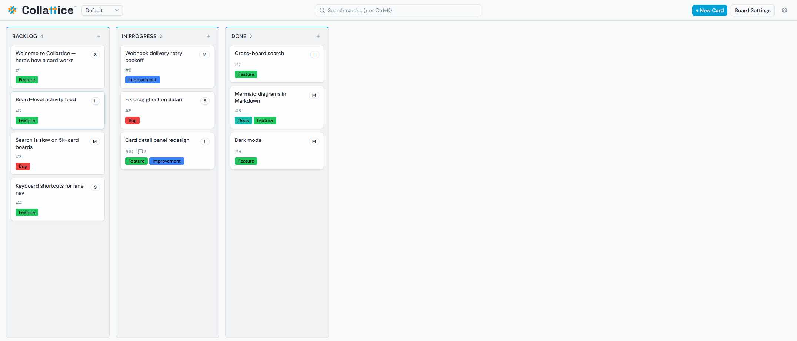

<p align="center">
  
</p>

<p align="center">
  <strong>A lightweight, self-hosted kanban board built for human-agent collaboration.</strong><br>
  Single executable. No database server. No containers. No cloud accounts.<br>
  Download, run, and open your browser.
</p>

<p align="center">
  <a href="https://github.com/MrBildo/collaboard/actions/workflows/ci.yml"></a>
  <a href="https://github.com/MrBildo/collaboard/releases/latest"></a>
  <a href="LICENSE"></a>
</p>

---

<p align="center">
  <a href="docs/images/board-overview.png"></a>
</p>

## Why Collaboard?

Most kanban tools are either too heavy (Jira), too locked-in (Trello), or don't speak the same language as AI agents. Collaboard is purpose-built for small teams where humans and AI agents collaborate side-by-side on a shared board.

- **Zero infrastructure** — single binary, embedded SQLite, no Docker, no cloud
- **AI-native** — built-in MCP endpoint with 19 tools. Agents create cards, move work, comment, label, and archive — all reflected in real-time
- **Real-time** — SSE pushes every change to all connected clients instantly
- **Just works** — download, run, open browser. Under 30 seconds to a working board

## Features

<a href="docs/images/card-detail.png"></a>

- **First-class AI agent support** — 19 MCP tools for full board management. Agents reference cards by number (`#42`) or ID, labels by name, and get enriched data in single calls
- **Real-time collaboration** — SSE streams every change to all clients. Agent moves a card? You see it live
- **Full Markdown** — descriptions and comments render GFM with tables, code blocks, headings, and inline formatting
- **Search** — cross-board search by card name, description, or number. Keyboard shortcut (`/` or `Ctrl+K`)
- **Drag-and-drop** — reorder cards and move between lanes
- **Clipboard paste & drag-drop uploads** — paste screenshots or drag files directly onto cards
- **Multi-board** — manage multiple boards from a single instance
- **Board-scoped labels** — color-coded labels with a full color picker (spectrum, hex input, eyedropper)
- **Deep linking** — direct URLs to boards and cards (`/boards/my-board/cards/42`)
- **Dark and light themes** — toggle between themes, persisted per browser

<a href="docs/images/dark-mode.png"></a>

<a href="docs/images/drag-drop-demo.gif"></a>

## Quick Start

### macOS / Linux

```bash
curl -sSL https://raw.githubusercontent.com/MrBildo/collaboard/main/install.sh | bash
~/.collaboard/Collaboard.Api
```

### Windows (PowerShell)

```powershell
irm https://raw.githubusercontent.com/MrBildo/collaboard/main/install.ps1 | iex
& "$env:LOCALAPPDATA\Collaboard\Collaboard.Api.exe"
```

Open **http://localhost:8080** in your browser. The admin auth key is printed to the console on first run — copy it to log in.

> For detailed installation options including manual download and macOS Gatekeeper, see the [Installation Guide](docs/installation.md).

## Deployment Shapes

Collaboard supports two production deployment shapes. The Quick Start above gives you the first one; the second is for teams that want the API and Portal hosted as separate processes (typically behind a reverse proxy).

- **LAN single-process (default).** One self-contained executable serves both the JSON API and the embedded React Portal from the same origin. SQLite database file lives next to the binary. No reverse proxy, no CORS, no static-site host required — just the one process listening on a port. This is the shape the Quick Start sets up, and it remains the recommended path for small teams on a trusted network.

- **Portal + API hosted separately.** The headless API (`Collaboard.Api` with `Hosting:ServeSpa=false`) runs as one process; the React Portal is built (`frontend/dist/`) and served by any static-file host on its own origin. The Portal reads a runtime `config.json` from its own origin to learn the API base URL, and the API allows the Portal's origin via `Cors:AllowedOrigins`. [Collabhost](https://github.com/MrBildo/collabhost) is one worked example; any static-site host paired with any process supervisor that can run a self-contained .NET binary works the same way.

See the [Installation Guide](docs/installation.md) for the LAN walkthrough and [INSTALL.md](INSTALL.md) for the hosted-separately walkthrough.

## Host Configuration

Collaboard ships with sensible defaults. Edit `appsettings.json` next to the
executable to override them — your edits are preserved across upgrades via the
installer's smart three-way merge (operator edits preserved, untouched defaults
refreshed, new shipped keys added). Environment variables override
`appsettings.json` for ad-hoc tweaks.

### Port and Bind Address

```jsonc
// appsettings.json
{
  "Urls": "http://0.0.0.0:9090"
}
```

Or via environment variable:

```bash
export Urls=http://0.0.0.0:9090
```

### Admin Auth Key

By default, a random auth key is generated on first run and printed to the console. To set a known key:

```jsonc
// appsettings.json
{
  "Admin": {
    "AuthKey": "my-secret-admin-key"
  }
}
```

### Database Location

The database path is **required** configuration with no default — the app never
derives a path from the working or binary directory. The installer writes an
absolute path into `appsettings.json` for you; to relocate the database, edit
it there (use an absolute path) — your edit is preserved by the smart-merge on
the next upgrade:

```jsonc
// appsettings.json
{
  "ConnectionStrings": {
    "Board": "Data Source=/srv/collaboard/data/collaboard.db"
  }
}
```

### Full Settings Reference

| Setting | Default | Description |
|---------|---------|-------------|
| `Urls` | *(unset)* | Convenience override for bind address and port. When set (or `ASPNETCORE_URLS` is set), it wins over the structured `Hosting:ListenAddress`/`Hosting:ListenPort` pair below. |
| `Hosting:ListenAddress` | `0.0.0.0` | Bind address. Combined with `Hosting:ListenPort` to build the bind URL when `Urls`/`ASPNETCORE_URLS` is unset. |
| `Hosting:ListenPort` | `8080` | Bind port. Combined with `Hosting:ListenAddress` to build the bind URL when `Urls`/`ASPNETCORE_URLS` is unset. |
| `Hosting:ServeSpa` | `true` | When `true`, the API also serves the embedded React Portal from `wwwroot/` (LAN single-process shape). Set to `false` for headless hosted-separately deployments — unmatched routes return 404 instead of the SPA shell. |
| `Cors:AllowedOrigins` | `[]` (empty) | List of allowed cross-origin Portal hosts. Empty disallows all cross-origin requests; same-origin LAN deployments do not need this. Set to the Portal's origin(s) for hosted-separately deployments (e.g. `["https://collaboard.example.com"]`). |
| `ConnectionStrings:Board` | *(required — no default)* | SQLite database path. Must be an **absolute** path; the installer writes this into `appsettings.json`. Startup fails loud if unset or unwritable. |
| `Admin:AuthKey` | *(auto-generated)* | Override the admin auth key |

### Version

```bash
./Collaboard.Api --version
```

## Board Configuration

### Fresh Install Defaults

On first run, Collaboard creates:
- An **Admin** user (auth key printed to the console — save this!)
- A **Default** board with three lanes: Backlog, In Progress, Done
- Two card sizes: S, M

### Obtaining the Admin Auth Key

The admin key is printed to the console on first startup:

```
[INF] Admin auth key: 01JQXYZ...
```

If you set `Admin:AuthKey` in config, that value is used instead. If you lose the key, check your config or the database.

### Admin Customization

Admins can configure boards via the **Board Settings** panel:

<a href="docs/images/board-settings.png"></a>

- **Lanes** — add, rename, reorder, or delete lanes
- **Sizes** — define card size options (e.g. S, M, L, XL) with custom ordinals
- **Labels** — create color-coded labels with a visual color picker
- **Prune** — bulk-delete old cards by age, lane, or label filters

### Managing Users

Create users via the **Admin** panel or the API:

```bash
# Create a human user
curl -X POST http://localhost:8080/api/v1/users \
  -H "X-User-Key: <admin-auth-key>" \
  -H "Content-Type: application/json" \
  -d '{"name": "Alice", "role": 1}'
```

The response includes the new user's `authKey`. Share it — they enter it on the login screen.

| Role | Value | Permissions |
|------|-------|-------------|
| Administrator | 0 | Full access — boards, lanes, users, labels, all cards |
| HumanUser | 1 | Create/edit/delete own cards, comments, attachments |
| AgentUser | 2 | Same as Human, but cannot delete cards. Can delete own comments/attachments |

## Usage

### Search

Press `/` or `Ctrl+K` to open the search bar. Search across all boards by card name, description, or card number (`#42`). Results appear in a dropdown grouped by board.

<a href="docs/images/search.png"></a>

### Attachments

- **Paste** — copy an image to clipboard, open a card, and paste (`Ctrl+V`). The image is uploaded as an attachment automatically.
- **Drag and drop** — drag files from your desktop onto the card detail view.
- **File size limit** — 5 MB per attachment.

### Working with AI Agents

Collaboard is designed for agents to be first-class participants. Set up an agent user and connect via MCP:

1. **Create an agent user** (as admin):
   ```bash
   curl -X POST http://localhost:8080/api/v1/users \
     -H "X-User-Key: <admin-auth-key>" \
     -H "Content-Type: application/json" \
     -d '{"name": "Claude Agent", "role": 2}'
   ```

2. **Store the auth key** in a `.agents.env` file (gitignored):
   ```
   COLLABOARD_AUTH_KEY=<agent-auth-key>
   ```

3. **Connect via MCP** — add to your agent's MCP config:
   ```json
   {
     "mcpServers": {
       "collaboard": {
         "type": "streamable-http",
         "url": "http://localhost:8080/mcp",
         "headers": { "X-User-Key": "<agent-auth-key>" }
       }
     }
   }
   ```

4. **Pre-fill tool permissions** for Claude Code CLI:
   ```jsonc
   // .claude/settings.json
   {
     "permissions": {
       "allow": [
         "mcp__collaboard__*"
       ]
     }
   }
   ```

Agents can then create cards, move work between lanes, add comments, manage labels, and upload attachments — all visible to human users in real-time.

## MCP Tools

19 tools for full board management:

| Category | Tools |
|----------|-------|
| System | `get_api_info` |
| Boards | `get_boards`, `get_lanes`, `get_sizes` |
| Cards | `create_card`, `move_card`, `update_card`, `get_cards`, `get_card` |
| Archive | `archive_card`, `restore_card` |
| Comments | `add_comment`, `delete_comment` |
| Attachments | `upload_attachment` (5MB base64), `download_attachment`, `delete_attachment` |
| Labels | `get_labels`, `add_label_to_card`, `remove_label_from_card` |

**Agent-friendly design:**
- Reference cards by **number** (`#42`) or GUID
- Reference labels by **name** (`"Bug"`) or ID
- `get_cards` returns enriched data — labels, sizes, comment and attachment counts
- `get_card` returns the full picture in one call — card, comments with usernames, labels, attachments
- `update_card` is a power tool — update fields, move lanes, and replace labels in a single operation

> Full REST API documentation: [API Reference](docs/api-reference.md)

## Updating

1. Stop the running process
2. Re-run the one-line installer (recommended) — it preserves your `appsettings.json`
   edits via smart-merge, refreshes untouched shipped defaults, and adds any new
   shipped keys. The `data/` directory is left untouched. A baseline sidecar
   (`appsettings.shipped.json`) is written next to `appsettings.json` for the next
   merge to use as its reference point.
3. For a manual install: extract the new release and run
   `./Collaboard.Api --merge-appsettings <new-appsettings.json> ./appsettings.json --baseline ./appsettings.shipped.json`
   from the install directory.
4. Start the app — migrations run automatically, database is backed up first

## Development

### Prerequisites

- .NET 10 SDK
- Node.js 22+
- Docker Desktop (for Aspire orchestration)

### Run with Aspire (recommended)

```powershell
dotnet run --project backend/Collaboard.AppHost
```

Launches both API and frontend with the Aspire dashboard for structured logs, traces, and metrics.

### Run Tests

```powershell
cd backend && dotnet test
```

### Build from Source

```bash
cd frontend && npm ci && npx vite build && cd ..
mkdir -p backend/Collaboard.Api/wwwroot
cp -r frontend/dist/* backend/Collaboard.Api/wwwroot/
dotnet publish backend/Collaboard.Api/Collaboard.Api.csproj \
  -c Release -r osx-arm64 --self-contained \
  /p:PublishSingleFile=true /p:Version=1.0.0 \
  -o publish/
```

## License

MIT
