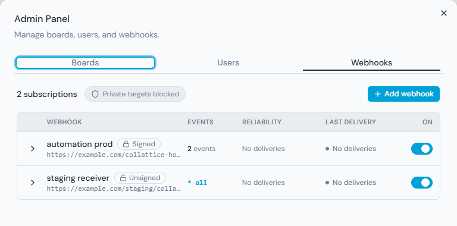
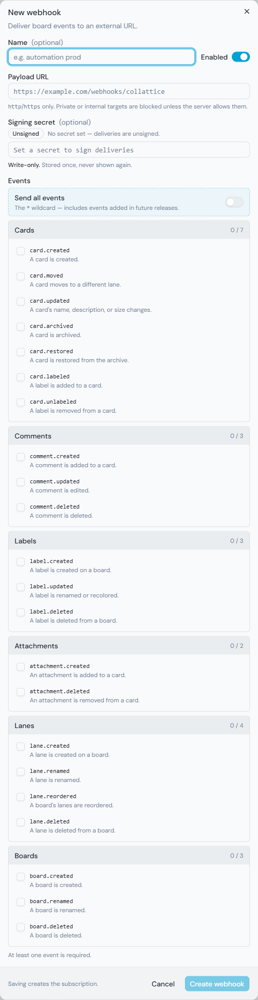

# Integrating with Webhooks

Collaboard can POST a structured event to a URL you choose whenever something
happens on a board — a card **created**, **moved**, or **labeled**; a comment
posted; a lane reordered; and more, across a 22-event catalog. That turns board
activity into a signal an external system can act on — a workflow automation tool,
a small script, an AI agent — without polling the API or holding a connection open.

Delivery targets are managed as **subscriptions**. You can register more than one,
and each one carries its own URL, an optional signing secret, an enabled/disabled
state, and a selection of which events it wants. You manage subscriptions three ways,
all equivalent: the built-in **Webhooks admin screen** (sign in as an administrator
and open it from the Admin panel), the **REST API** (the examples below), and — if
you're an agent — the matching **MCP tools**.



This guide is the practical walkthrough: register a subscription, point it somewhere,
send a test delivery to confirm it arrived, and read the delivery log when something
looks wrong. It also covers the one rule you should read **before** you point a webhook
at anything that creates cards — the recursion guard.

For the exact field-by-field contract (the envelope, every payload shape, the
headers, the signing scheme), the **full 22-event catalog**, and the complete list of
management endpoints, see the [API Reference](api-reference.md#webhooks). For the host
settings, see [Host Configuration](../README.md#webhooks).

---

## Read this first: the recursion guard

If your automation reacts to a `card.created` event by **creating a card** — a very
common shape, e.g. "a card landed in Inbox, so create a follow-up card" — you have
built a loop. The card your automation creates fires its own `card.created`, which
triggers your automation, which creates another card, and so on. With agents in the
mix this is a *when*, not an *if*.

Every event carries an `actor` telling you **who** caused it, and `actor.role` is the
field that breaks the loop. The four possible role values are:

- `Administrator`
- `HumanUser`
- `AgentUser`
- `AgentAdministrator`

**Filter on a human-role allowlist, not an agent-role denylist.** Forward an event
to your automation only when the actor is a human:

```js
const HUMAN_ROLES = ["Administrator", "HumanUser"];

if (!HUMAN_ROLES.includes(event.actor.role)) {
  return; // an agent caused this — ignore it, don't let the loop run
}
// ...your automation here
```

Why an allowlist and not `if (event.actor.role !== "AgentUser") { ... }`? Because the
agent side has **two** roles today (`AgentUser` and `AgentAdministrator`), and the set
can grow. A denylist that names `AgentUser` silently lets an `AgentAdministrator`-created
card through — and the day a new agent role is added, every denylist that didn't know
about it springs a leak. Allowlisting the two human roles excludes every present and
future agent role by default. The safe set is the one that doesn't change when new
roles appear.

This is the single most important line in your consumer. Get it in place before you
wire the create side of anything.

---

## Create a subscription

Register a delivery target by POSTing to `/api/v1/webhooks/subscriptions`. This is an
administrator-level endpoint — send it with an **Administrator** or
**AgentAdministrator** key in the `X-User-Key` header:

```bash
curl -X POST http://localhost:8080/api/v1/webhooks/subscriptions \
  -H "X-User-Key: <admin-auth-key>" \
  -H "Content-Type: application/json" \
  -d '{
        "url": "https://automation.example.com/collaboard-hook",
        "events": ["card.created", "card.moved"],
        "name": "automation prod"
      }'
```

The response is the created subscription, including its `id` — you'll need that to
update, test, or delete it later — and a `signed` flag. To sign deliveries, include a
`secret` in the body: it's the HMAC key your receiver verifies against (see
[Verifying the signature](#verifying-the-signature-optional)). The secret is
write-only — accepted on create or update, never read back.

> **Already using `Webhooks:Endpoint`?** If an earlier version was configured with a
> single `Webhooks:Endpoint` (and an optional `Webhooks:Secret`), that endpoint is
> migrated into a subscription automatically the first time this version starts — you
> don't need to recreate it and you won't lose it. After upgrading, manage it like any
> other subscription, and unset `Webhooks:Endpoint` so it isn't seeded again if you later
> delete it. See the [upgrade note](../README.md#webhooks) for one important caveat about
> private-network targets.

### Private and internal targets are blocked by default

For safety, Collaboard blocks webhook deliveries to private and internal network
addresses — loopback, LAN ranges, link-local, and the like. A URL that resolves to one
of those is rejected when you create the subscription; and a target that resolves
publicly at create time but to an internal address at delivery time is blocked at the
moment of connection (so a DNS rebind can't sneak past the create-time check).

If your receiver is legitimately on a private network — a self-hosted tool on your LAN
— set `Webhooks__AllowPrivateNetworkTargets=true` and restart. One thing to know about
that flag: it re-permits the **private LAN ranges only** (the RFC1918 ranges and IPv6
unique-local). It does **not** re-open loopback (`127.0.0.1`, `::1`), the link-local
range, or the cloud-metadata endpoint (`169.254.169.254`) — those stay blocked no matter
what, so turning the flag on to reach a LAN host can never also expose your machine's own
loopback services or a cloud provider's metadata service. The flag is a single global
switch — all-or-nothing across every subscription, not a per-subscription setting.

A **Tailscale** address (the `100.x` carrier-grade-NAT range) is treated as an ordinary
reachable target and delivers **without** the flag. See
[Host Configuration](../README.md#webhooks) for the exact ranges and the upgrade impact.

### Confirm it's on

The boot log shows the global webhook state:

- `Webhooks enabled — delivery routes to the subscription registry.` — delivery is on.
- `Webhooks disabled (Webhooks:Enabled = false).` — the master switch is off; no
  subscription delivers.

An admin can query the same global posture at any time:

```
GET /api/v1/webhooks/status
→ {
    "enabled": true,
    "allowPrivateNetworkTargets": false,
    "subscriptionCount": 1,
    "enabledSubscriptionCount": 1
  }
```

This returns booleans and counts only — never a secret or a URL — so it's safe to expose
to a setup tool. To see the subscriptions themselves, `GET /api/v1/webhooks/subscriptions`.

---

## Choosing which events

Each subscription names the events it wants in its `events` list. There are 22 event
types, covering the full board-scoped lifecycle, grouped into six families:

- **Cards** — `card.created`, `card.moved`, `card.updated`, `card.archived`,
  `card.restored`, `card.labeled`, `card.unlabeled`.
- **Comments** — `comment.created`, `comment.updated`, `comment.deleted`.
- **Labels** — `label.created`, `label.updated`, `label.deleted`.
- **Attachments** — `attachment.created`, `attachment.deleted`.
- **Lanes** — `lane.created`, `lane.renamed`, `lane.reordered`, `lane.deleted`.
- **Boards** — `board.created`, `board.renamed`, `board.deleted`.

The admin screen's create/edit dialog lets you tick these by family; over the API and
MCP you pass the exact type strings. For the payload each one carries, see the
[event catalog in the API Reference](api-reference.md#event-types).



List the exact types you want (`["card.created"]`, or several), or use the single wildcard
`"*"` to receive **every** event type — including any added in future versions:

```json
{ "url": "https://...", "events": ["*"] }
```

The wildcard is the "subscribe to everything, now and later" option: a subscription set
to `"*"` automatically picks up new event types as they're added, with no edit on your
part. A subscription with an explicit list receives only the types it names and ignores
the rest. The list can't be empty — a subscription must select at least one event type
(an empty selection is *not* treated as "all"; it's rejected). An unknown event type is
rejected too, with the list of valid ones in the error.

---

## Managing subscriptions

You can register as many subscriptions as you need — say, one pointed at a production
automation and another at a staging receiver, each with its own event selection. They're
managed through the same administrator-level endpoints:

- **List** — `GET /api/v1/webhooks/subscriptions` returns every subscription with its
  current state plus delivery metrics (success and failure counts, and the last
  delivery's status and time). Secrets are never included.
- **Update** — `PATCH /api/v1/webhooks/subscriptions/{id}` changes any field; anything
  you omit is left as-is. To pause a subscription without deleting it, set
  `{ "enabled": false }`; re-enable it with `{ "enabled": true }`.
- **Delete** — `DELETE /api/v1/webhooks/subscriptions/{id}` removes it. Its delivery-log
  history is kept, so you can still see why a now-deleted webhook had been failing.

**Changing the secret** follows a set / keep / clear rule, so you can edit other fields
without disturbing it:

- omit `secret` → the existing secret is **kept**;
- send `"secret": "new-value"` → it's **replaced**;
- send `"clearSecret": true` → it's **removed**, and the subscription goes unsigned.

Pausing one subscription (`enabled: false`) affects only that one. The global
`Webhooks:Enabled` setting is the master switch above all of them — set it to `false` and
nothing delivers, whatever each subscription's own state is.

---

## Send a test delivery

To confirm a subscription's endpoint actually receives a payload, send it a test
delivery — you don't have to create real cards to exercise the wiring:

```
POST /api/v1/webhooks/subscriptions/{id}/test
```

This sends one `webhook.ping` event to that subscription through the exact same path a
real event takes — the same private-network guard, the same signing — and returns the
outcome right away:

```json
{ "success": true, "statusCode": 200, "error": null }
```

A `success: false` comes back with the reason in `error` (a connection refused, a TLS or
DNS failure, a non-2xx response, or a blocked private-network target). The test also
shows up in the delivery log like any other attempt. Agents have the same affordance as
the `test_webhook` MCP tool.

The `webhook.ping` event is delivery-only — board activity never produces it and a
subscription can't select it; it exists purely so you can prove an endpoint is reachable.

> If you'd rather see a real event end to end, create or move a card on a **scratch
> board** — not a live one. A webhook fires for *every* matching event on every board it
> selects, so exercising the wiring on a real board triggers your real automation against
> real cards. The test delivery above avoids that entirely.

---

## What you receive

A `card.created` POST body looks like this (the full contract is in the
[API Reference](api-reference.md#the-envelope)):

```json
{
  "event": "card.created",
  "eventId": "01J9ZQK8H6F4N3M2P7R5T8V0XW",
  "occurredAt": "2026-06-18T16:42:25.770Z",
  "version": "1",
  "boardId": "f6fa6794-4bed-44d0-9656-de8080791302",
  "boardSlug": "collaboard",
  "actor": { "userId": "52df8c11-...", "name": "Bill Wheelock", "role": "Administrator" },
  "data": {
    "card": { "number": 321, "name": "Investigate flaky test", "laneId": "b7c8...", "position": 0, "...": "..." },
    "laneName": "Inbox"
  }
}
```

A few things worth knowing so you don't misread a payload:

- **Filter on names, not GUIDs.** `boardSlug` and the lane names (`data.laneName`, and
  `data.from`/`data.to` on a move) are right there in the body — you can route on
  `boardSlug === "research" && data.to.laneName === "Ready"` without a single lookup.

- **The card is state *at the moment of the event*, not current state.** A
  `card.created` event always shows `commentCount: 0`, `attachmentCount: 0`, and
  `latestComment: null` — the card was just born. That's correct, not a missing value.
  Don't treat those zeros as a bug or a sign the payload is incomplete.

- **A draft card does not fire until it's finalized.** When someone composes a card
  interactively, Collaboard holds a temporary draft until they commit it. The
  `card.created` event fires on finalize, not while the draft is being typed — so an
  in-progress compose that gets cancelled never produces an event. You only ever see
  real, committed cards.

- **Ignore fields you don't recognize.** Within `version: "1"`, new fields may be
  *added* to the payload over time. Your consumer must tolerate that — parse leniently
  and ignore unknown fields. A strict-schema deserializer configured to reject any key
  it wasn't told about will break the first time Collaboard adds a field, even though
  nothing about the contract you depend on changed. (If a change is ever *breaking*,
  the `version` value bumps — so you can branch on it.)

- **Sort on `occurredAt`, don't trust arrival order.** Delivery is best-effort and
  not strictly ordered, so two events can arrive out of the order they happened. If
  ordering matters to your automation, sort on `occurredAt` (the server-side
  timestamp of when the fact happened) rather than the order POSTs land.

- **Deduplicate on `eventId`.** Delivery is at-least-once: a retry after a flaky
  response can deliver the same event twice. The `eventId` (a ULID) is stable across
  retries of one event, so keep a short memory of recently-seen ids and drop repeats.

---

## Verifying the signature (optional)

If a subscription has a `secret`, every delivery to it is signed so your endpoint can
confirm it really came from Collaboard. The signature rides in a header:

```
X-Collattice-Signature: sha256=<hex-lowercase-digest>
```

The digest is HMAC-SHA256 over the **exact raw bytes of the request body**, keyed by
the shared secret. To verify, compute the same HMAC over the body **as you received
it** — before parsing it as JSON or re-serializing — and compare against the header
value with a constant-time comparison:

```js
import { createHmac, timingSafeEqual } from "node:crypto";

function isValid(rawBody, header, secret) {
  const expected = "sha256=" + createHmac("sha256", secret).update(rawBody).digest("hex");
  const a = Buffer.from(header);
  const b = Buffer.from(expected);
  return a.length === b.length && timingSafeEqual(a, b);
}
```

The one trap to avoid: sign the bytes you *received*, not a re-serialized copy of the
parsed object. Re-serializing can reorder keys or change whitespace, and the HMAC
won't match even though the payload is genuine.

---

## When it breaks

Delivery is **asynchronous and never blocks the board.** When a card is created or
moved, the operator's action returns immediately; the webhook is delivered in the
background. So a slow or dead endpoint never makes the board feel slow or fails a
card operation — but it also means a failed delivery is quiet unless you go look.

Two places to look:

**The delivery log.** Every attempt — success or failure — is recorded. An admin can
read it:

```
GET /api/v1/webhooks/deliveries?boardId={id}
```

Filter to one board with `boardId`, or to a single webhook with `subscriptionId={id}`
(handy when several subscriptions are firing and you want to isolate one). Each row
carries the subscription id, the event id and type, the attempt number, the status
(`Succeeded` / `Failed`), the HTTP status code (when there was a response), and a
truncated error (for timeouts, TLS/DNS failures, connection refused, or a non-2xx
body). A subscription that's silently failing shows up here as a run of `Failed` rows —
which is exactly the thing a fire-and-forget integration otherwise hides.

**The retry behavior.** A failed delivery is retried up to `Webhooks:MaxAttempts`
times (default 3): the first try is immediate, then a short backoff before each
retry (roughly the `Webhooks:RetryBackoffBase` wait, growing for later retries, with
a little jitter). After the final attempt fails, Collaboard records the failure and
logs it at a level the operator can see — so a permanently dead endpoint is loud, not
a black hole.

> **One honest caveat: the delivery log is not a complete record across a restart.**
> The delivery queue lives in memory. If the API restarts while an event is waiting
> to be delivered, that event is simply dropped — and because it never reached the
> attempt stage, it leaves **no `Failed` row**. It's gone with no trace in the log. So
> don't treat the delivery log as a guaranteed ledger of everything that ever
> happened; treat it as the record of everything Collaboard *attempted to deliver*.
> In practice a dropped-across-restart event is rare and recoverable while you're at a
> small scale (the card it was about is sitting right there on the board), so this is
> an acceptable trade-off — but it's worth knowing before you build something that
> assumes the log is exhaustive.

---

## A worked example

This is the shape any HTTP-receiving receiver follows — a workflow automation tool,
a small server, a script, an AI agent — nothing here is specific to one product.

1. Register a URL with your automation tool or receiver that accepts HTTP POST requests.
2. Create a subscription pointing at that URL (`POST /api/v1/webhooks/subscriptions`)
   with the events you want. Send it a [test delivery](#send-a-test-delivery) and confirm
   your receiver sees the `webhook.ping`.
3. In your receiver, apply the [recursion guard](#read-this-first-the-recursion-guard)
   immediately — drop the event when `actor.role` is not in
   `["Administrator", "HumanUser"]`.
4. Branch on what you care about — e.g. `event === "card.moved"` and
   `data.to.laneName === "Ready"` — and wire the rest of your automation off that.
5. Create or move a card to see a real event land, then point the subscription at the
   work you actually mean.

That's the whole shape: Collaboard emits the fact, your tool decides what to do with
it, and the recursion guard keeps an automation that creates cards from chasing its
own tail.
