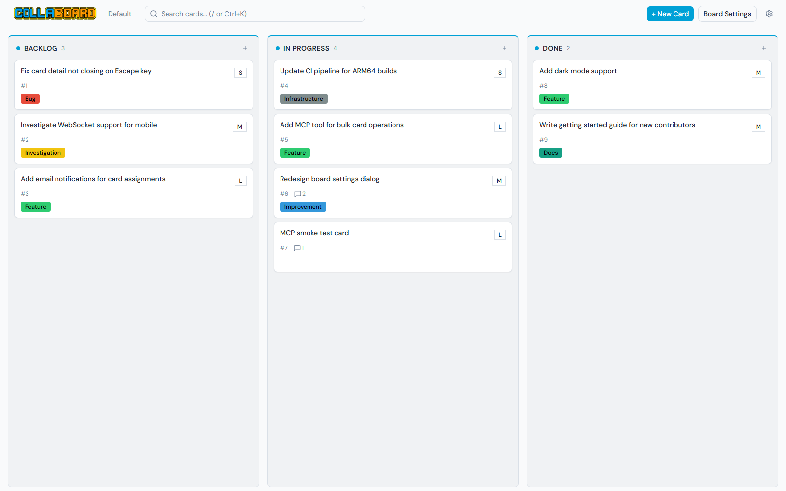
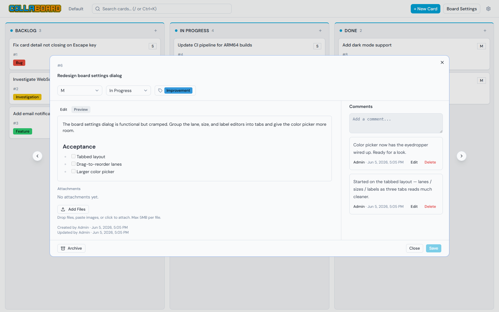
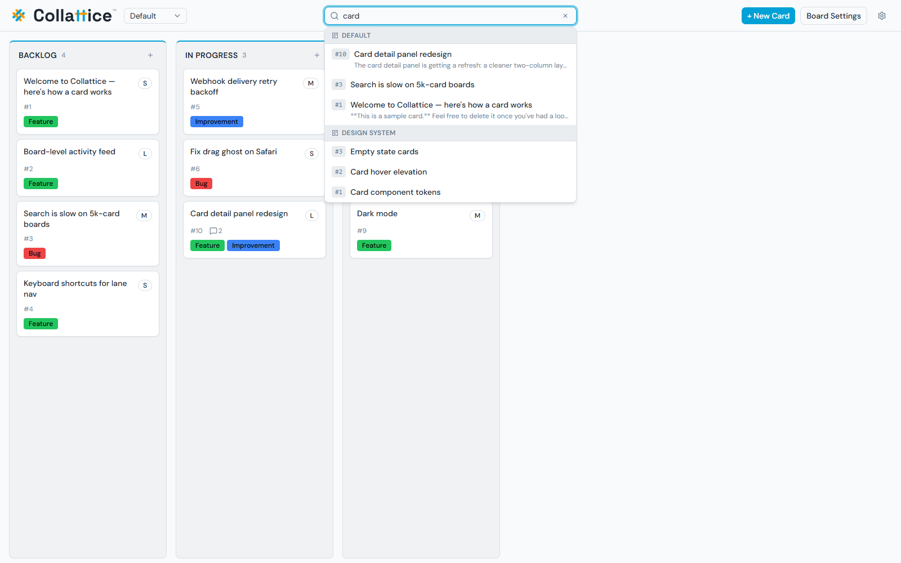
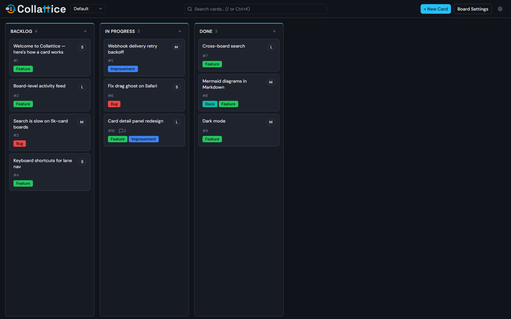
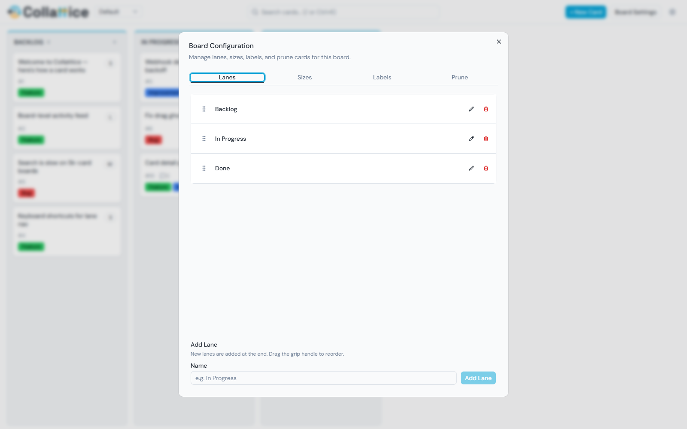

# Collaboard User Guide

Welcome to Collaboard — a lightweight kanban board for small teams where people and
AI agents work side by side on the same board. This guide is for the **person at the
keyboard**: everything you can do from the browser, organized by what you actually
do with it.

If you haven't installed Collaboard yet, start with the
[Installation Guide](installation.md). If you're setting up an **AI agent** to use
the board, the human guide stops being the right map — see
[For Agents](#for-agents-and-automation) near the end, which points you at the
agent-facing docs.

---

## Contents

- [Signing in](#signing-in)
- [The board at a glance](#the-board-at-a-glance)
- [Working with cards](#working-with-cards)
  - [Creating a card](#creating-a-card)
  - [Opening and editing a card](#opening-and-editing-a-card)
  - [Moving cards around](#moving-cards-around)
  - [Comments](#comments)
  - [Attachments](#attachments)
  - [Archiving and deleting](#archiving-and-deleting)
- [Lanes, sizes, and labels](#lanes-sizes-and-labels)
- [Searching](#searching)
- [Writing with Markdown](#writing-with-markdown)
- [Real-time collaboration](#real-time-collaboration)
- [Multiple boards](#multiple-boards)
- [Deep links and sharing](#deep-links-and-sharing)
- [Light and dark themes](#light-and-dark-themes)
- [Board settings (admins)](#board-settings-admins)
- [Users and roles (admins)](#users-and-roles-admins)
- [For agents and automation](#for-agents-and-automation)
- [Tips](#tips)

---

## Signing in

Collaboard identifies you by an **auth key** — a long string unique to your account.
There are no passwords and no email sign-up. Your key *is* your identity: every card
you create, every comment you write, and every move you make is attributed to you.

When you open Collaboard you'll see a sign-in screen. Paste your auth key into the
box and select **Log In**.

- **Where your key comes from.** If you're the person who installed Collaboard, your
  admin key is printed to the console the first time the app starts — copy it from
  there. If someone else runs the board, ask them to create an account for you; they
  hand you a key to paste in.
- **Your key is remembered.** Once you sign in, the browser keeps you signed in — you
  won't be asked again on that browser until you sign out.
- **Keep it private.** Treat your key like a password. Anyone who has it can act as
  you on the board.

To sign out, open the **gear menu** (the ⚙ icon in the top-right corner) and choose
**Logout**.

---

## The board at a glance

A board is a set of **lanes** (the vertical columns) holding **cards** (the work
items). The default board ships with three lanes — **Backlog**, **In Progress**, and
**Done** — but lanes are just named columns, and an admin can rename, add, reorder,
or remove them to match how your team works.

Across the top is the header:

- The **Collaboard logo** (top-left).
- The **board name** — or, if you have more than one board, a **board switcher**
  dropdown for hopping between them.
- The **search box** in the middle — find any card across every board (see
  [Searching](#searching)).
- **+ New Card** to create a card.
- **Board Settings** (admins only) to configure lanes, sizes, labels, and pruning.
- The **gear menu** (⚙) — your theme toggle, the Admin panel (admins), and Logout.

> On a narrow window or a phone, the **+ New Card** button, **Board Settings**, and
> search collapse into the gear menu to save space. Everything is still reachable
> from there.
>
> Drag-and-drop is a **desktop feature**. On a phone or narrow window, dragging is
> turned off — moving cards, reordering lanes, and reordering sizes by dragging are
> not available. Use the dropdowns in the card detail panel to move a card instead
> (lane reordering and size reordering are desktop-only).

Each lane shows its name, a count of the cards in it, and a small **+** to add a card
directly to that lane. Each card shows its number (like `#42`), its title, any
labels, its size (the small `S` / `M` / `L` / `XL` badge in the corner), and small
icons for its comment and attachment counts.

---

## Working with cards

A card is one unit of work — a task, a bug, an idea. It has a title, an optional
description, a lane, a size, labels, comments, and attachments.

### Creating a card

There are two ways to create a card:

- Select **+ New Card** in the header to open the create dialog.
- Select the small **+** at the top of any lane to create a card already placed in
  that lane.

In the dialog, give the card a **title** (required), and optionally a description, a
lane, a size, and labels. You can even attach files before the card exists — they
upload as soon as you save. New cards land at the **top** of their lane.

### Opening and editing a card

Select any card to open its detail panel.

From here you can change everything about the card:

- **Title** — select it and type.
- **Size** — the dropdown in the top-left of the panel.
- **Lane** — the lane dropdown; changing it moves the card.
- **Labels** — the label picker; add or remove color-coded tags.
- **Description** — written in Markdown. The **Edit** tab is where you type; the
  **Preview** tab shows it rendered (tables, code blocks, checklists, and more — see
  [Writing with Markdown](#writing-with-markdown)).

Your edits aren't saved until you select **Save** at the bottom of the panel. If you
try to close the panel with unsaved changes, Collaboard asks before discarding them.
Select **Close** (or press **Escape**) to dismiss the panel.

The **‹** and **›** arrows on the sides of the panel step to the previous and next
card without closing it — handy for reviewing a lane card by card.

> **Someone edited this card while you had it open?** Collaboard handles that
> gracefully. Fields you *haven't* touched update live to match the latest value.
> Fields you *are* editing show a small dot so you don't lose your work — hover it to
> see what changed and choose **Accept remote** if you'd rather take their version.

### Moving cards around

On a desktop, cards move by **drag-and-drop**:

- **Within a lane** — drag a card up or down to reorder it.
- **Between lanes** — drag a card into a different lane to change its status.

You can also change a card's lane from inside its detail panel using the lane
dropdown. On a phone or narrow window, drag is turned off, so the lane dropdown is
**the** way to move a card. Either way, everyone connected to the board sees the move
happen live.

### Comments

Every card has a **Comments** panel (on the right of the detail view). Comments are
the durable memory of a card — what happened, what changed, what's next.

- Type in the **Add a comment** box and submit to post.
- Comments render **Markdown**, so you can use lists, code blocks, links, and
  formatting.
- You can **Edit** or **Delete** your own comments. Admins can edit or delete anyone's.

Comments are an especially good idea on a board shared with agents or other people —
a short note on a card is how the next person (or bot) picks up where you left off
without having been there.

### Attachments

Attach files — screenshots, logs, documents — directly to a card. In the card's
**Attachments** section you can:

- **Drag and drop** files onto the panel.
- **Paste** an image straight from your clipboard (great for screenshots).
- **Select Add Files** to pick from your computer.

Each file can be up to **5 MB** through the browser. Attachments show who added them
and when, and anyone viewing the card can **Download** them. You can delete
attachments you added; admins can delete any.

### Archiving and deleting

When a card is finished or no longer relevant, you have two options:

- **Archive** (the button at the bottom-left of the card panel) hides the card from
  the board but keeps it forever. Archived cards are **frozen** — you can't edit,
  comment on, or change them — but they stay searchable and can be **restored** to any
  lane at any time. Archiving is reversible and safe.
- **Delete** removes a card permanently. Deleting is gone-for-good, so it's reserved
  for genuine mistakes (a card created in error). Admins can delete any card; a
  regular user can delete their own cards but not others'.

The rule of thumb: **archive** for "this served its purpose," **delete** only for
"this shouldn't exist." A restored card comes back exactly as it was.

---

## Lanes, sizes, and labels

Three pieces of structure shape how a board reads. Admins configure them in
[Board Settings](#board-settings-admins); everyone uses them.

- **Lanes** are the columns. They have no built-in meaning — they mean whatever your
  team decides. A common pattern is a left-to-right pipeline (Backlog → In Progress →
  Done), but you can build any flow that fits your process.
- **Sizes** are an estimate badge on each card (the default set is `S` / `M` / `L` /
  `XL`). Most teams use size to mean *how much effort and risk* a card carries, not
  how urgent it is. Every card has exactly one size.
- **Labels** are color-coded tags. A card can carry several. Labels are great for
  marking the *kind* of work (Bug, Feature, Docs) so you can scan or filter for it
  later. A fresh board starts with **no labels** — an admin adds the ones your team
  wants.

---

## Searching

Press **`/`** or **`Ctrl+K`** (anywhere on the board) to jump to the search box, or
just select it. Search finds cards across **every board**, not only the one you're
looking at.

- **Type any text** to match card titles and descriptions. Results appear as you
  type, grouped by board.
- **Type a number** to find a card by its number — `42` jumps straight to card `#42`.
- Use the **arrow keys** to move through results and **Enter** to open the highlighted
  one. **Escape** clears the box.
- **Archived cards** that match show up under their own *Archived* heading, dimmed, so
  you can find something you've put away without it cluttering the live results.

---

## Writing with Markdown

Card **descriptions** and **comments** are written in
[Markdown](https://www.markdownguide.org/basic-syntax/) and render richly. Use the
**Preview** tab on a description (or just post a comment) to see the result. What's
supported:

- **Standard formatting** — headings, **bold**, *italic*, `inline code`, blockquotes,
  ordered and unordered lists, links, and images.
- **Tables** — Markdown pipe tables.
- **Task lists** — `- [ ]` and `- [x]` render as checkboxes.
- **Strikethrough** — `~~like this~~`.
- **Code blocks with syntax highlighting** — fence a block with triple backticks and
  tag it with a language for colored code.
- **Diagrams** — a code block tagged `mermaid` renders as a
  [Mermaid](https://mermaid.js.org/) diagram (flowcharts, sequence diagrams, and
  more).
- **Emoji shortcodes** — `:rocket:` becomes 🚀.
- **Card links** — type `#42` in a description or comment and it becomes a clickable
  link to card 42 on the same board.

External links open in a new tab. For safety, raw HTML is sanitized — harmless
presentational tags work, but scripts and unsafe content are stripped.

> **Tip:** use real line breaks when you write. Press Enter for a new line; don't type
> a literal `\n`.

---

## Real-time collaboration

Collaboard is **live**. Every change — a card moved, a comment posted, a label
added, a lane reordered — streams to everyone connected to the board the instant it
happens. There's no refresh button to hunt for and no "someone else changed this,
reload?" dialog.

This is what makes a shared board work when several people (and agents) are active at
once: you watch the board update under you in real time. If an agent moves a card
while you're looking at the board, you see it move.

---

## Multiple boards

One Collaboard instance can run **as many boards as you like** — for example, a board
per project, per team, or per workstream. Each board is fully independent: its own
lanes, cards, labels, and sizes, and its own card numbering (every board starts at
`#1`).

When more than one board exists, a **board switcher** dropdown appears in the header
next to the logo. Use it to move between boards. Admins create new boards from the
Admin panel.

> Search always spans **all** boards, so you can find a card even when you don't
> remember which board it's on.

---

## Deep links and sharing

Boards and cards have stable URLs you can bookmark or paste to a teammate:

- A board: `…/boards/my-board`
- A specific card: `…/boards/my-board/cards/42`

Opening a card link takes the recipient straight to that card's detail panel (they'll
sign in first if they haven't already). Board addresses use a readable **slug**
derived from the board's name, so the links stay legible.

---

## Light and dark themes

Collaboard ships with **light** and **dark** themes. Open the **gear menu** (⚙) and
select **Dark mode** / **Light mode** to switch.

Your choice is remembered per browser, so the board comes back in the theme you left
it in.

---

## Board settings (admins)

Admins configure a board from the **Board Settings** panel (the button in the header,
or under the gear menu on smaller screens). It has four tabs:

- **Lanes** — add a lane (new lanes appear at the end), rename it, or delete it. To
  **reorder** lanes, drag a lane's header directly on the board, or drag the grip
  handle in this tab. Reordering is a **desktop feature** — on a phone or narrow
  window, dragging is turned off and lanes can't be reordered. A lane must be empty
  before it can be deleted.
- **Sizes** — define the size options cards can use and control their order. To
  reorder sizes, drag the grip handle in this tab — also a **desktop feature**, so
  reordering isn't available on a phone or narrow window.
- **Labels** — create color-coded labels with a visual **color picker** (pick from a
  spectrum, type a hex value, or use the eyedropper to sample a color on screen),
  rename them, recolor them, or delete them. Deleting a label simply un-tags it from
  every card — it doesn't delete the cards.
- **Prune** — bulk-**archive** old cards by a filter: older than a date, in certain
  lanes, or with certain labels. You can preview exactly which cards match before
  committing, and pruning archives (it never deletes), so nothing is lost.

---

## Users and roles (admins)

Admins manage people and agents from the **Admin** panel (in the gear menu). Creating
a user produces an **auth key** you hand to that person or agent — that key is how
they sign in.

Each user has a **role** that sets what they can do:

| Role | What they can do |
|------|------------------|
| **Administrator** | Full control — boards, lanes, sizes, labels, users, and every card. |
| **Human User** | Create, edit, and delete their **own** cards, comments, and attachments. |
| **Agent User** | Same as a human user, but **cannot delete cards** (it can delete its own comments and attachments). Intended for AI agents. |
| **Agent Administrator** | An agent with admin-level board management (lanes, sizes, labels, pruning, bulk operations). |

If a key is ever exposed, deactivate that user and create a fresh one — a deactivated
user can no longer sign in.

Everyone can see every board; there's no per-board membership. Roles govern *what you
can change*, not *which boards you can see*.

---

## For agents and automation

Collaboard isn't only for people. It has a built-in **MCP (Model Context Protocol)**
server, so an AI agent can operate the board directly — create cards, move work,
comment, label, search, and manage attachments — through the same board you're
looking at. Humans and agents share one board and see each other's changes live.

If you're setting up an agent, this user guide isn't the right reference. Use these
instead:

- **[Operating Collaboard via MCP](mcp-skill.md)** — the complete, factual reference
  for the agent tool surface: how to connect, every tool, the board model, the
  identifier rules, and the Markdown the board renders. This is the document an agent
  needs.
- **[Workflow & Tips](workflow-tips.md)** — an optional companion: lessons learned
  running a human-plus-agent board, including how to issue per-agent keys and a sample
  lane workflow. Suggestions, not requirements.

The [README](../README.md#for-agents) also has a quick MCP setup snippet for
connecting a client like Claude Code.

---

## Tips

A few small habits that make the board nicer to live in:

- **Write comments for someone with no context.** On a shared board, the next person
  (or agent) to touch a card may not have been there when you worked on it. A short
  note — what you did, what's next — is the handoff.
- **Archive instead of delete.** Archiving is reversible and keeps the record; delete
  is permanent. Reach for delete only for genuine mistakes.
- **Let the board be the source of truth.** On a busy board, what's on screen is
  authoritative — a card may have moved or gained a comment since you last looked.
  Glance at a card's latest comment before acting on it.
- **Learn the search shortcut.** `/` or `Ctrl+K` from anywhere, then a number to jump
  straight to a card. It's the fastest way around a busy board.

---

Questions about installing or running the server (ports, database location, upgrades)
live in the [Installation Guide](installation.md) and the
[README](../README.md#host-configuration). Happy collaborating.
